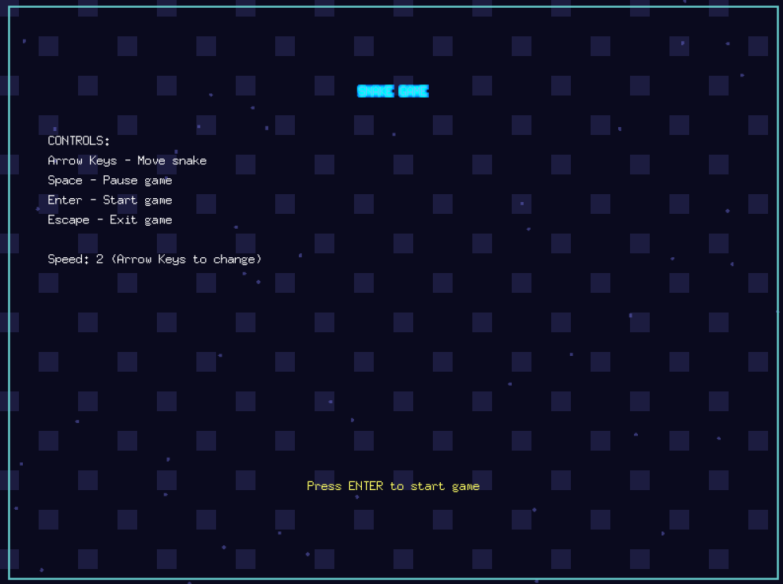
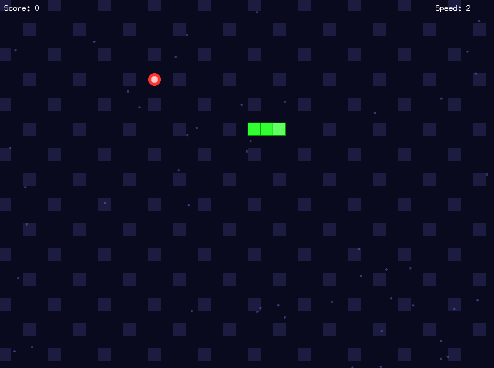
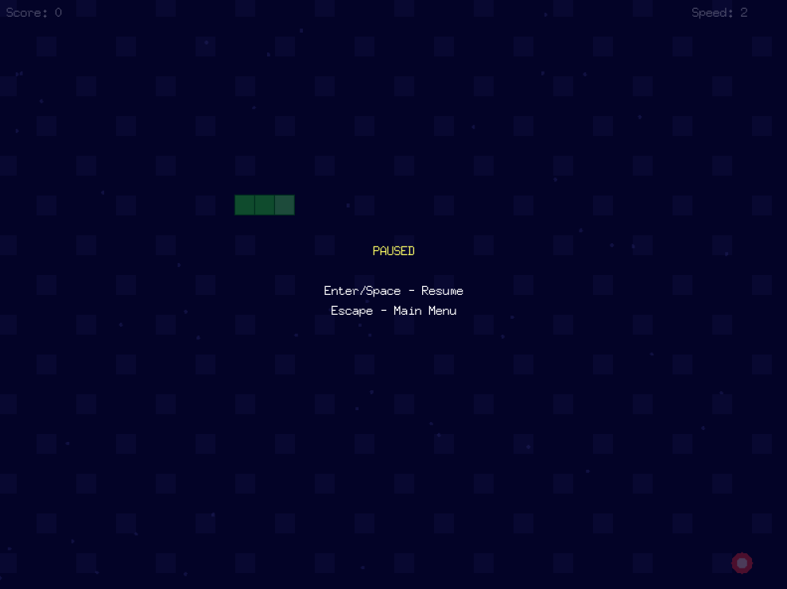

<!--markdownlint-disable-->
# 🐍 Змейка

Простая, но увлекательная классическая игра Змейка, где вам предстоит управлять змейкой, чтобы съесть как можно больше еды, не врезаясь в стены и не перекусив себя. Игра написана на Go с использованием библиотеки Ebiten.

## 🎮 Особенности

- **Пять уровней скорости**: от медленной до очень быстрой
- **Управление с клавиатуры**: интуитивное перемещение змейки стрелками
- **Система очков**: подсчет съеденной еды
- **Красивый интерфейс**: стильное меню с анимациями
- **Пауза**: возможность приостановить игру в любой момент

## 📸 Скриншоты

| Главное меню             | Игровой процесс         | Меню паузы                |
| ------------------------ | ----------------------- | ------------------------- |
|  |  |  |

## 🕹️ Управление

- **Стрелки** - движение змейки
- **Пробел** - пауза/продолжение игры
- **Enter** - подтверждение выбора/новая игра
- **ESC** - выход из игры/возврат в главное меню

## 🚀 Установка и запуск

1. Убедитесь, что у вас установлен Go (версия 1.16 или выше)
2. Клонируйте репозиторий:

```bash
git clone https://github.com/Kirutka/Snake
cd snake-game
```

3. Установите зависимости:

```bash
go mod tidy
```

4. Запустите игру:

```bash
cd cmd
go run main.go
```

## 📦 Сборка

Для сборки исполняемого файла:

```bash
go build -o snake-game cmd/main.go
```

## 🛠️ Технические детали

- Размер экрана: 800×600 пикселей
- Размер сетки: 20×20 пикселей
- 5 уровней скорости: от 1 (медленно) до 5 (очень быстро)
- Реализовано на чистом Go с графической библиотекой Ebiten

## 📄 Лицензия

Этот проект распространяется под лицензией MIT. Подробнее см. в файле LICENSE.md